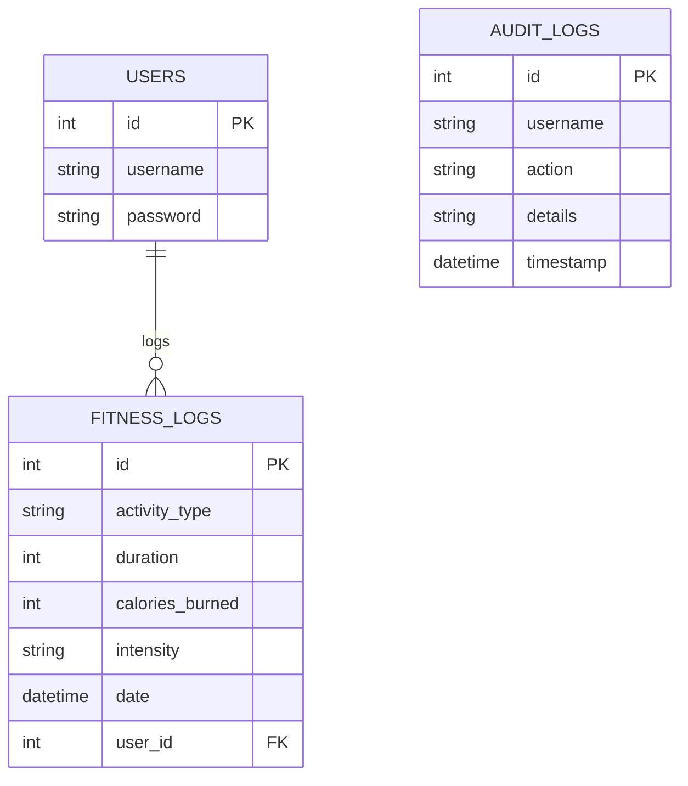

# Health and Fitness App Report

## Outline

Bitality is a comprehensive web-based health and fitness application designed to help individuals track their physical activity and monitor their health metrics. The application allows users to securely log and view their daily workouts, including details such as activity type, duration, calories burned, and intensity intensity. Beyond simple logging, Bitality provides valuable health tools including BMI (Body Mass Index), BMR (Basal Metabolic Rate), and Macronutrient calculators to better inform user health decisions. Integrated charting and dashboard widgets offer visual feedback on progress. The platform prioritizes user privacy with secure authentication and session management, while a responsive, high-contrast "Dark Mode" design ensures accessibility and a premium user experience across devices. The goal is to provide an intuitive, all-in-one platform for personal health management.

## Architecture

The application utilizes a classic **Three-Tier Architecture** implemented via the **Model-View-Controller (MVC)** pattern:

1.  **Presentation Tier (View):** EJS templates render dynamic HTML pages on the server, served to the client browser.
2.  **Application Tier (Controller):** Node.js and Express handle routing, business logic, authentication, and request processing.
3.  **Data Tier (Model):** A MySQL database securely stores relational data for users, fitness logs, and audit trails.


## Data Model

The database schema (`health`) is normalized and consists of three primary tables:

1.  **`users`**: Manages authentication (ID, unique username, password).
2.  **`fitness_logs`**: Stores workout activities. It has a Foreign Key (`user_id`) relationship with `users` (One-to-Many).
3.  **`audit_logs`**: Tracks system events for security and debugging.



## User Functionality

**Authentication & Profiles**
Users must register and login to access personal data. The system enforces strong passwords for security. The **Profile Page** aggregates user statistics (total workouts, calories) and displays recent activity history.


**Workout Logging**
The **Add Workout** feature allows users to log exercises with specific metrics like duration, calories, and intensity. This data is validated server-side to ensure accuracy (e.g., positive integers).

**Search & History**
A robust **Search** function filters workout history by activity type, allowing users to quickly find past runs, swims, or cycles.


**Health Tools**
Bitality includes a suite of calculators:

-   **BMI Calculator:** Assesses weight category.
-   **BMR Calculator:** Estimates daily caloric needs.
-   **Macro Calculator:** Suggests nutrient splits based on fitness goals (lose/gain weight).


**Utilities**

-   **Water Tracker:** A daily counter for hydration goals.
-   **Audit Log:** A transparency feature allowing users to view recorded system actions associated with their account.


## Advanced Techniques

**1. Model-View-Controller (MVC) Pattern**
The codebase is structured to strictly separate concerns. Routes (`routes/fitness.js`) handle logic, Views (`views/*.ejs`) handle display, and the Database handles storage. This improves maintainability compared to monolithic scripts.

**2. Custom Middleware for Security**
I implemented custom middleware `requireLogin` to protect sensitive routes. This ensures that unauthenticated users cannot access or modify fitness data using forced redirection.

_Reference: `routes/fitness.js`_

```javascript
const requireLogin = (req, res, next) => {
    if (req.session.loggedin) {
        next();
    } else {
        res.redirect("/users/login");
    }
};
router.use(requireLogin);
```

**3. Server-Side Validation & Sanitization**
Using `express-validator`, input is rigorously checked and sanitized before touching the database. This prevents SQL injection and bad data entry (e.g., negative calories).

_Reference: `routes/fitness.js`_

```javascript
check("duration").isInt({ min: 1 }).withMessage("Duration must be a positive number"),
// ...
const errors = validationResult(req);
```

**4. Design System with CSS Variables**
A custom "Dark Mode" theme was built using CSS Custom Properties (`--bg-color`, `--accent`). This allows for dynamic client-side theming without page reloads, toggled via a simple JS script that updates the `body` class.

## AI Declaration

I utilized an AI coding assistant (Google DeepMind's Antigravity) to accelerate the development process.

-   **Boilerplate & Structure:** The AI generated the initial Express server setup (`index.js`) and directory structure.
-   **Debugging:** The AI helped identify and fix a missing database route for the Audit Log feature and corrected `init_db.js` configuration credential mismatches.
-   **Documentation:** The AI assisted in formatting this report and generating the Mermaid diagrams for the architecture and data model.
-   **Verification:** An AI agent was used to perform black-box testing of the application by simulating user interactions (browsing, clicking, logging) to verify functionality.

All logic, especially the core fitness calculations and database queries, was reviewed and refined to ensure it met the specific assignment requirements.
